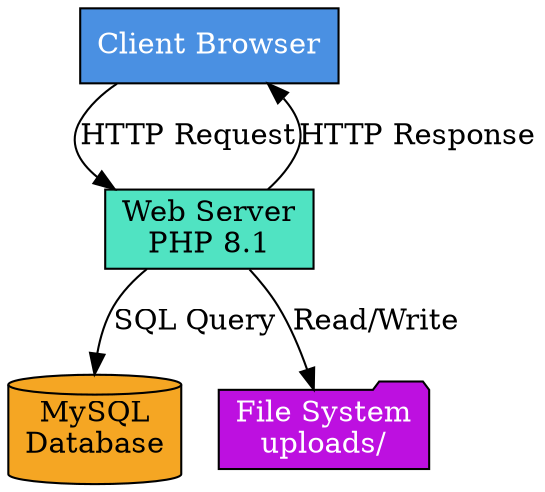
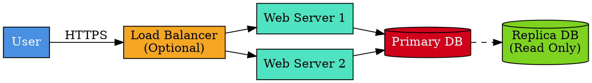
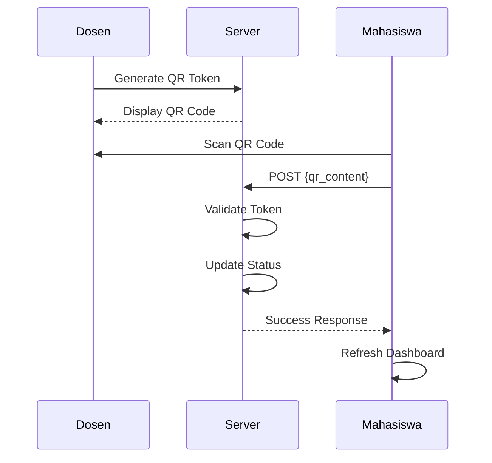
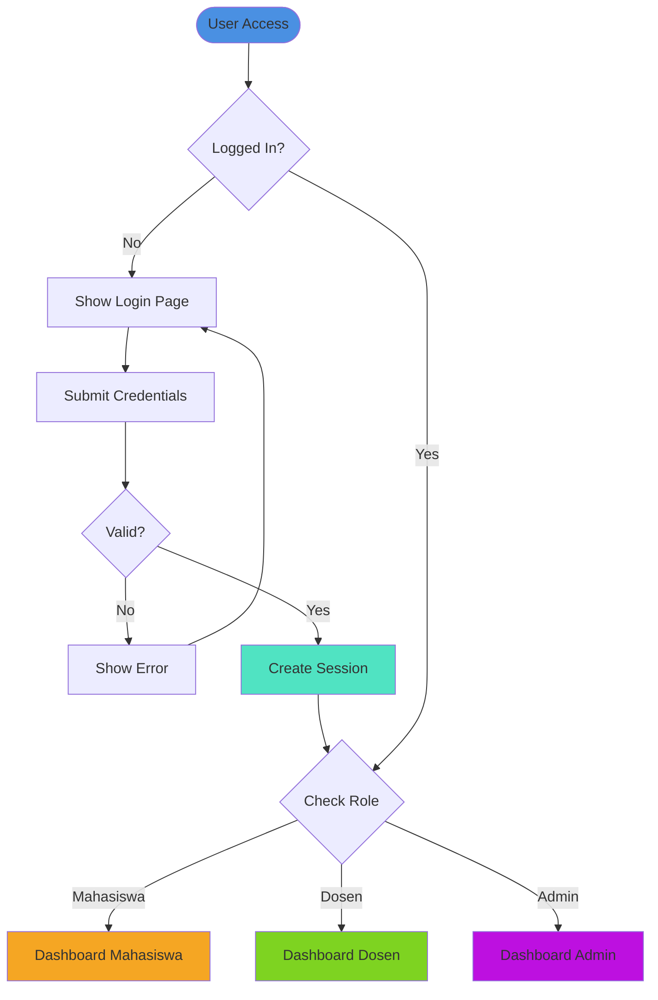
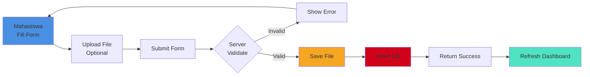
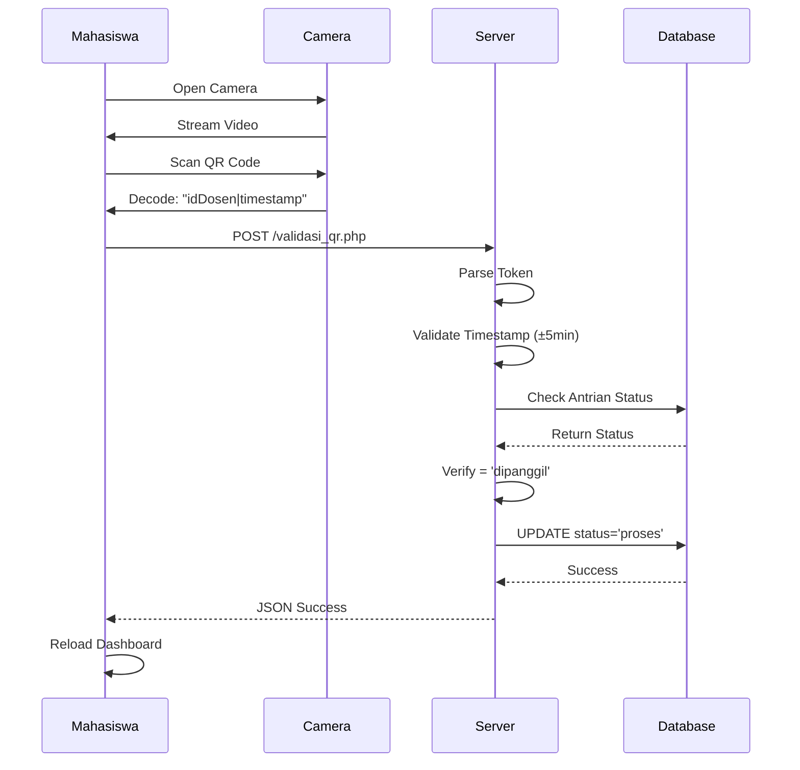

# 🏗️ Arsitektur Sistem BimCheck

Dokumentasi arsitektur dan design pattern yang digunakan dalam aplikasi BimCheck.

---

## 📑 Daftar Isi

- [Arsitektur Tingkat Tinggi](#arsitektur-tingkat-tinggi)
- [Arsitektur Aplikasi](#arsitektur-aplikasi)
- [Design Patterns](#design-patterns)
- [Technology Stack](#technology-stack)
- [Security Architecture](#security-architecture)

---

## 🌐 Arsitektur Tingkat Tinggi

### System Architecture Diagram

**Visualize at:** https://dreampuf.github.io/GraphvizOnline/



### Deployment Architecture

**Visualize at:** https://dreampuf.github.io/GraphvizOnline/



---

## 📐 Arsitektur Aplikasi

### Layered Architecture

BimCheck menggunakan arsitektur berlapis (layered architecture):

```
┌─────────────────────────────────────┐
│   Presentation Layer (Views)        │
│   - dashboard_mahasiswa.php         │
│   - dashboard_dosen.php             │
│   - login.php                       │
└─────────────────────────────────────┘
              ↓↑
┌─────────────────────────────────────┐
│   Business Logic Layer (Actions)    │
│   - validasi_qr.php                 │
│   - update_status.php               │
│   - upload_dokumen.php              │
└─────────────────────────────────────┘
              ↓↑
┌─────────────────────────────────────┐
│   Data Access Layer (Config)        │
│   - koneksi.php                     │
│   - mysqli queries                  │
└─────────────────────────────────────┘
              ↓↑
┌─────────────────────────────────────┐
│   Database Layer (MySQL)            │
│   - Tables: antrian, mahasiswa,     │
│     dosen, users                    │
└─────────────────────────────────────┘
```

### MVC-like Pattern

Meskipun tidak pure MVC, aplikasi ini mengikuti prinsip separation of concerns:

**Model** → Implicit dalam queries di setiap file
**View** → File PHP dengan HTML/CSS/JavaScript
**Controller** → Actions folder + logic di dalam views

---

## 🎯 Design Patterns

### 1. Front Controller Pattern

**Implementation:** `index.php`

```php
// index.php sebagai entry point
if (!isset($_SESSION['status'])) {
    // Not logged in
    include 'views/login.php';
} else {
    // Route based on role
    switch($_SESSION['role']) {
        case 'mahasiswa': 
            include 'views/dashboard_mahasiswa.php';
            break;
        case 'dosen':
            include 'views/dashboard_dosen.php';
            break;
        // ...
    }
}
```

**Benefits:**
- Centralized routing
- Session checking
- Easy to add middleware

---

### 2. Repository Pattern (Simplified)

**Current Implementation:** Direct mysqli queries

**Example:**
```php
// views/dashboard_mahasiswa.php
$qActive = mysqli_query($conn, "
    SELECT a.*, d.nama_dosen 
    FROM antrian a 
    JOIN dosen d ON a.id_dosen = d.id_dosen 
    WHERE a.id_mahasiswa = '$id_mahasiswa'
");
```

**Recommended:** Extract to repository classes
```php
// Recommendation
class AntrianRepository {
    public function getActiveQueue($id_mahasiswa) {
        // Query logic here
    }
}
```

---

### 3. Strategy Pattern for Status Updates

**Used in:** `actions/update_status.php`

Different strategies for different actions:

```php
switch($action) {
    case 'panggil':
        // Strategy: Call student
        $query = "UPDATE antrian SET 
                  status='dipanggil', 
                  waktu_panggil=NOW() 
                  WHERE id_antrian='$id'";
        break;
        
    case 'selesai':
        // Strategy: Complete booking
        $query = "UPDATE antrian SET 
                  status='selesai', 
                  deskripsi=CONCAT(deskripsi, '$feedback')
                  WHERE id_antrian='$id'";
        break;
}
```

---

### 4. Observer Pattern (QR Scanning)

**Flow:**
1. Dosen generates QR (Observable)
2. Mahasiswa scans QR (Observer)
3. Server validates & updates status (Event Handler)
4. Dashboard refreshes (UI Update)



---

## 🔧 Technology Stack Detail

### Backend Stack

```yaml
Language: PHP 8.1+
  Features Used:
    - Type declarations
    - Arrow functions
    - Null coalescing operator
    - Spread operator
    
Database: MySQL 8.0+
  Features Used:
    - Foreign Keys
    - Indexes (composite)
    - ENUM types
    - DATETIME functions
    - JSON (recommended)
    
Authentication: Session-based
  Storage: Server filesystem
  Security: HTTP-only cookies
```

### Frontend Stack

```yaml
HTML5:
  - Semantic elements
  - Form validation
  - Input types (date, time, file)
  
CSS: TailwindCSS 3.x (CDN)
  - Utility-first
  - Responsive utilities
  - Custom color palette
  - Gradient backgrounds
  
JavaScript ES6+:
  - Fetch API
  - Promises
  - Template literals
  - Arrow functions
  - Destructuring
```

### Libraries & Dependencies

| Library | Version | Purpose |
|---------|---------|---------|
| Html5-QRCode | 2.3.8 | QR Scanner (mahasiswa) |
| QRCode.js | 1.0.0 | QR Generator (dosen) |
| Font Awesome | 6.4.0 | Icons |
| TailwindCSS | 3.x | CSS Framework |

---

## 🔐 Security Architecture

### Authentication Flow



### Authorization Layers

```
Request → Session Check → Role Validation → Resource Access
   ↓           ↓               ↓                 ↓
 HTTP      isset()      $_SESSION['role']    Allow/Deny
Request    status?         == expected?       
```

### Password Hashing

```php
// Registration
$hashedPassword = password_hash($password, PASSWORD_BCRYPT, ['cost' => 10]);

// Login
if (password_verify($inputPassword, $hashedPassword)) {
    // Success
}
```

### File Upload Security

```
Upload Request
    ↓
Type Validation (extension whitelist)
    ↓
Size Validation (max 5MB)
    ↓
Generate Unique Filename (timestamp + random)
    ↓
Store in uploads/ (outside public if possible)
    ↓
Save path in DB (relative path)
    ↓
Return Success
```

---

## 📊 Data Flow Architecture

### Booking Flow



### QR Validation Flow



---

## 🗂️ File Organization

### Directory Structure Philosophy

```
Separation of Concerns:
├── /actions     → Backend logic (controllers)
├── /config      → Configuration (database)
├── /views       → Frontend (presentation)
├── /assets      → Static resources
├── /uploads     → User-generated content
└── /dokumentasi → Technical documentation
```

### Naming Conventions

| Type | Convention | Example |
|------|------------|---------|
| Database | snake_case | `id_mahasiswa`, `waktu_panggil` |
| PHP Variables | camelCase | `$idDosen`, `$nomorAntrian` |
| PHP Files | snake_case | `dashboard_mahasiswa.php` |
| CSS Classes | kebab-case | `bg-blue-500`, `rounded-lg` |
| JavaScript | camelCase | `openDetailModal()` |

---

## 🚀 Performance Architecture

### Database Optimization

**Indexes:**
```sql
-- Single column indexes
KEY `idx_tanggal` (`tanggal`)
KEY `idx_status` (`status`)

-- Composite indexes (lebih efisien)
KEY `idx_tanggal_status` (`tanggal`,`status`)
KEY `idx_id_dosen_tanggal` (`id_dosen`,`tanggal`)
```

**Query Optimization:**
- Use JOINs instead of subqueries
- WHERE dengan indexed columns
- LIMIT untuk pagination
- Avoid SELECT *

### Caching Strategy (Recommended)

```
┌────────────┐
│   Client   │
└─────┬──────┘
      │ Request
      ↓
┌────────────┐
│   Cache    │  ← Redis/Memcached
│  (Session) │     (Recommended)
└─────┬──────┘
      │ Cache Miss
      ↓
┌────────────┐
│  Database  │
└────────────┘
```

---

## 📈 Scalability Considerations

### Horizontal Scaling

**Current:** Single server
**Recommended:**
- Load balancer (Nginx)
- Multiple PHP-FPM workers
- Database replication (master-slave)
- Shared session storage (Redis)

### Vertical Scaling

**PHP Configuration:**
```ini
memory_limit = 256M
max_execution_time = 60
upload_max_filesize = 5M
post_max_size = 8M
```

---

## 🔄 API Architecture (Future)

**Recommended:** RESTful API separation

```
/api/v1/
  ├── /auth
  │   ├── POST /login
  │   └── POST /logout
  ├── /antrian
  │   ├── GET /
  │   ├── POST /
  │   └── PUT /:id
  ├── /qr
  │   ├── GET /generate
  │   └── POST /validate
  └── /users
      ├── GET /
      ├── POST /
      ├── PUT /:id
      └── DELETE /:id
```

---

Dokumentasi arsitektur ini menjelaskan design decisions dan best practices yang digunakan dalam BimCheck.
