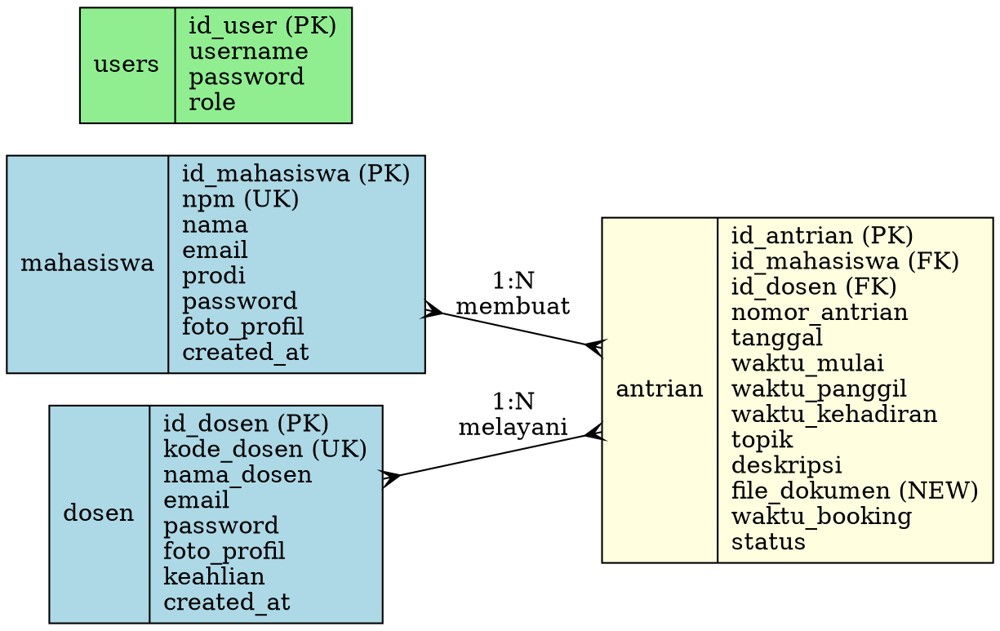

# 💾 Database Schema - BimCheck

Dokumentasi lengkap skema database, relasi antar tabel, dan query patterns.

---

## 📑 Daftar Isi

- [Overview Database](#overview-database)
- [Entity Relationship Diagram](#entity-relationship-diagram)
- [Tabel dan Struktur](#tabel-dan-struktur)
- [Relasi dan Foreign Keys](#relasi-dan-foreign-keys)
- [Indexes dan Optimasi](#indexes-dan-optimasi)
- [Query Patterns](#query-patterns)

---

## 🗄️ Overview Database

**Database Name:** `bimcheck`
**Charset:** `utf8mb4`
**Collation:** `utf8mb4_0900_ai_ci`
**Engine:** InnoDB

### Statistik

| Item | Count |
|------|-------|
| Total Tables | 4 (aktif) |
| Total Columns | ~30 |
| Total Indexes | 10+ |
| Foreign Keys | 3 |

---

## 🔗 Entity Relationship Diagram

**Visualize at:** https://dreampuf.github.io/GraphvizOnline/



---

## 📊 Tabel dan Struktur

### 1. Tabel `mahasiswa`

**Purpose:** Menyimpan data mahasiswa yang terdaftar

| Column | Type | Null | Default | Description |
|--------|------|------|---------|-------------|
| id_mahasiswa | INT | NO | AUTO_INCREMENT | Primary Key |
| npm | VARCHAR(20) | NO | - | NPM mahasiswa (UNIQUE) |
| nama | VARCHAR(100) | NO | - | Nama lengkap |
| email | VARCHAR(100) | NO | - | Email mahasiswa |
| prodi | VARCHAR(100) | NO | - | Program studi |
| password | VARCHAR(255) | NO | - | Password (hashed) |
| foto_profil | VARCHAR(255) | YES | NULL | Path foto profil |
| created_at | TIMESTAMP | YES | CURRENT_TIMESTAMP | Waktu registrasi |

**Indexes:**
- PRIMARY KEY (`id_mahasiswa`)
- UNIQUE KEY `npm` (`npm`)

**Sample Data:**
```sql
INSERT INTO mahasiswa VALUES
(2, '714', 'Mahasiswa Tester', 'test@mhs.id', 'Teknik Informatika', 
 '$2y$10$...', NULL, '2025-12-29 13:10:22');
```

---

### 2. Tabel `dosen`

**Purpose:** Menyimpan data dosen pembimbing

| Column | Type | Null | Default | Description |
|--------|------|------|---------|-------------|
| id_dosen | INT | NO | AUTO_INCREMENT | Primary Key |
| kode_dosen | VARCHAR(20) | NO | - | Kode dosen (UNIQUE) |
| nama_dosen | VARCHAR(100) | NO | - | Nama lengkap dosen |
| email | VARCHAR(100) | YES | NULL | Email dosen |
| password | VARCHAR(255) | NO | - | Password (hashed) |
| foto_profil | VARCHAR(255) | YES | NULL | Path foto profil |
| keahlian | VARCHAR(100) | YES | NULL | Bidang keahlian |
| created_at | TIMESTAMP | YES | CURRENT_TIMESTAMP | Waktu registrasi |

**Indexes:**
- PRIMARY KEY (`id_dosen`)
- UNIQUE KEY `kode_dosen` (`kode_dosen`)

**Sample Data:**
```sql
INSERT INTO dosen VALUES
(4, '713', 'budi', NULL, '$2y$10$...', NULL, 
 'teknik informatika', '2026-01-15 02:25:42');
```

---

### 3. Tabel `antrian` ⭐ Main Table

**Purpose:** Menyimpan semua data booking dan riwayat bimbingan

| Column | Type | Null | Default | Description |
|--------|------|------|---------|-------------|
| id_antrian | INT | NO | AUTO_INCREMENT | Primary Key |
| id_mahasiswa | INT | NO | - | FK ke mahasiswa |
| id_dosen | INT | NO | - | FK ke dosen |
| nomor_antrian | INT | NO | - | Nomor urut per hari |
| tanggal | DATE | YES | NULL | Tanggal booking |
| waktu_mulai | TIME | YES | NULL | Waktu mulai yang diinginkan |
| waktu_panggil | DATETIME | YES | NULL | Waktu dosen memanggil |
| waktu_kehadiran | DATETIME | YES | NULL | Waktu mahasiswa scan QR |
| topik | VARCHAR(255) | YES | NULL | Topik bimbingan |
| deskripsi | TEXT | YES | NULL | Deskripsi + feedback |
| **file_dokumen** | VARCHAR(255) | YES | NULL | **[NEW]** Path file upload |
| waktu_booking | DATETIME | YES | CURRENT_TIMESTAMP | Waktu booking dibuat |
| status | ENUM | YES | 'menunggu' | Status antrian |

**ENUM Status Values:**
- `menunggu` - Booking diterima, belum dipanggil
- `dipanggil` - Dosen sudah memanggil, waiting QR scan
- `proses` - Mahasiswa hadir, sedang bimbingan
- `selesai` - Bimbingan selesai
- `revisi` - Perlu revisi/perbaikan
- `dilewati` - Mahasiswa tidak hadir

**Indexes:**
```sql
PRIMARY KEY (`id_antrian`)
KEY `idx_tanggal` (`tanggal`)
KEY `idx_status` (`status`)
KEY `idx_tanggal_status` (`tanggal`,`status`)  -- Composite
KEY `idx_id_dosen_tanggal` (`id_dosen`,`tanggal`)  -- Composite
KEY `idx_id_mahasiswa_tanggal` (`id_mahasiswa`,`tanggal`)  -- Composite
```

**Foreign Keys:**
```sql
FOREIGN KEY (`id_mahasiswa`) REFERENCES mahasiswa(`id_mahasiswa`) 
    ON DELETE CASCADE

FOREIGN KEY (`id_dosen`) REFERENCES dosen(`id_dosen`) 
    ON DELETE CASCADE
```

**Sample Data:**
```sql
INSERT INTO antrian VALUES
(15, 2, 4, 2, '2026-01-21', '14:34:00', '2026-01-21 14:34:48', 
 NULL, 'Tt', 'Yy', NULL, '2026-01-21 14:34:41', 'dipanggil');
```

---

### 4. Tabel `users`

**Purpose:** Admin users untuk CRUD operations

| Column | Type | Null | Default | Description |
|--------|------|------|---------|-------------|
| id_user | INT | NO | AUTO_INCREMENT | Primary Key |
| username | VARCHAR(50) | NO | - | Username admin |
| password | VARCHAR(255) | NO | - | Password (hashed) |
| role | ENUM | YES | 'admin' | Role ('admin') |

**Indexes:**
- PRIMARY KEY (`id_user`)

---

### 5. Tabel `riwayat_bimbingan` ❌ DEPRECATED

**Status:** TIDAK DIGUNAKAN - Akan dihapus

**Reason:** Riwayat sudah ada di tabel `antrian` dengan status-based filtering

```sql
-- Tabel ini TIDAK DIGUNAKAN dan bisa dihapus
CREATE TABLE `riwayat_bimbingan` (
  `id_riwayat` int NOT NULL,
  `id_antrian` int NOT NULL,
  `catatan` text,
  `tanggal_selesai` datetime DEFAULT CURRENT_TIMESTAMP
);
```

**Migration untuk menghapus:**
```sql
ALTER TABLE `riwayat_bimbingan` DROP FOREIGN KEY `riwayat_bimbingan_ibfk_1`;
DROP TABLE `riwayat_bimbingan`;
```

---

## 🔗 Relasi dan Foreign Keys

### Diagram Relasi

```
mahasiswa (1) ────< (N) antrian (N) >──── (1) dosen
    │                                          │
    └─ id_mahasiswa                           └─ id_dosen
```

### CASCADE DELETE Behavior

**Scenario:** Jika mahasiswa dihapus
```sql
DELETE FROM mahasiswa WHERE id_mahasiswa = 2;
-- Auto-delete: Semua antrian dari mahasiswa tersebut
```

**Scenario:** Jika dosen dihapus
```sql
DELETE FROM dosen WHERE id_dosen = 4;
-- Auto-delete: Semua antrian ke dosen tersebut
```

---

## 📈 Indexes dan Optimasi

### Index Strategy

**1. Single Column Indexes**
```sql
KEY `idx_tanggal` (`tanggal`)
-- Use Case: Filter antrian by date
-- Query: WHERE tanggal = '2026-01-21'

KEY `idx_status` (`status`)
-- Use Case: Filter by status
-- Query: WHERE status = 'menunggu'
```

**2. Composite Indexes** (Lebih Efisien)
```sql
KEY `idx_tanggal_status` (`tanggal`,`status`)
-- Use Case: Antrian aktif hari ini
-- Query: WHERE tanggal = CURDATE() AND status IN (...)

KEY `idx_id_dosen_tanggal` (`id_dosen`,`tanggal`)
-- Use Case: Dashboard dosen
-- Query: WHERE id_dosen = 4 AND tanggal = CURDATE()

KEY `idx_id_mahasiswa_tanggal` (`id_mahasiswa`,`tanggal`)
-- Use Case: Dashboard mahasiswa
-- Query: WHERE id_mahasiswa = 2 AND tanggal >= ...
```

### Query Performance

**EXPLAIN Example:**
```sql
EXPLAIN SELECT * FROM antrian 
WHERE id_dosen = 4 AND tanggal = CURDATE();

-- Result: Uses idx_id_dosen_tanggal (key_len: 8)
-- Rows scanned: ~10 instead of full table
```

---

## 🔍 Query Patterns

### 1. Get Active Queue (Dashboard Dosen)

```sql
SELECT 
    a.*,
    m.nama,
    m.npm,
    m.prodi
FROM antrian a
JOIN mahasiswa m ON a.id_mahasiswa = m.id_mahasiswa
WHERE a.id_dosen = ?
  AND a.tanggal = CURDATE()
  AND a.status IN ('menunggu', 'dipanggil', 'proses', 'dilewati')
ORDER BY 
    FIELD(a.status, 'proses', 'dipanggil', 'menunggu', 'dilewati'),
    a.nomor_antrian ASC;
```

**Performance:**
- Uses composite index `idx_id_dosen_tanggal`
- JOIN instead of subquery
- FIELD() untuk custom sort

---

### 2. Get History (Dashboard Mahasiswa)

```sql
SELECT 
    a.*,
    d.nama_dosen
FROM antrian a
JOIN dosen d ON a.id_dosen = d.id_dosen
WHERE a.id_mahasiswa = ?
  AND a.status IN ('selesai', 'revisi', 'dilewati')
ORDER BY a.tanggal DESC
LIMIT 20;
```

---

### 3. Generate Queue Number

```sql
SELECT COUNT(*) as total 
FROM antrian 
WHERE id_dosen = ? 
  AND tanggal = ?;

-- Nomor antrian = total + 1
```

---

### 4. Timeout Check (Auto-Lewati)

```sql
UPDATE antrian 
SET status = 'dilewati'
WHERE status = 'dipanggil'
  AND TIMESTAMPDIFF(MINUTE, waktu_panggil, NOW()) >= 60;
```

**Executes:** Setiap page load dashboard dosen
**Performance:** Uses `idx_status` index

---

### 5. QR Validation Query

```sql
-- Step 1: Find antrian that is 'dipanggil' by this mahasiswa
SELECT * FROM antrian
WHERE id_mahasiswa = ?
  AND id_dosen = ?
  AND status = 'dipanggil'
  AND tanggal = CURDATE()
LIMIT 1;

-- Step 2: Update to 'proses' if found
UPDATE antrian
SET status = 'proses',
    waktu_kehadiran = NOW()
WHERE id_antrian = ?;
```

---

### 6. Call Next Student

```sql
-- Step 1: Find next menunggu
SELECT * FROM antrian
WHERE id_dosen = ?
  AND tanggal = CURDATE()
  AND status = 'menunggu'
ORDER BY nomor_antrian ASC
LIMIT 1;

-- Step 2: Update status
UPDATE antrian
SET status = 'dipanggil',
    waktu_panggil = NOW()
WHERE id_antrian = ?;
```

---

### 7. Complete Bimbingan with Feedback

```sql
UPDATE antrian
SET status = 'selesai',
    deskripsi = CONCAT(deskripsi, '[Feedback Dosen: ', ?, ']')
WHERE id_antrian = ?;
```

**Format:** `{original_deskripsi} [Feedback Dosen: {feedback}]`

---

## 📝 Data Integrity Rules

### Constraints

1. **NPM & Kode Dosen UNIQUE**
   - Prevent duplicate users
   - Enforced at DB level

2. **Foreign Key Constraints**
   - Maintain referential integrity
   - CASCADE DELETE for cleanup

3. **ENUM for Status**
   - Limit to valid values only
   - Prevent typos/invalid status

### Business Rules

**Rule 1:** Nomor antrian unique per dosen per hari
```sql
-- Check before insert:
SELECT COUNT(*) FROM antrian
WHERE id_dosen = ? AND tanggal = ?;
```

**Rule 2:** Mahasiswa tidak bisa booking ganda di hari sama
```sql
-- Recommended check:
SELECT COUNT(*) FROM antrian
WHERE id_mahasiswa = ?
  AND tanggal = ?
  AND status != 'dilewati';
-- If > 0: Reject booking
```

**Rule 3:** QR valid ±5 menit dari generate
```php
// Calculate timestamp in 5-minute blocks
$timestamp = floor(time() / (5 * 60));
```

---

## 🚀 Optimization Tips

### 1. Use Prepared Statements

**Current (Vulnerable to SQL Injection):**
```php
$query = "SELECT * FROM mahasiswa WHERE npm='$npm'";
```

**Recommended:**
```php
$stmt = $conn->prepare("SELECT * FROM mahasiswa WHERE npm=?");
$stmt->bind_param("s", $npm);
$stmt->execute();
```

### 2. Avoid SELECT *

**Bad:**
```sql
SELECT * FROM antrian WHERE id_dosen = 4;
```

**Good:**
```sql
SELECT id_antrian, topik, status, tanggal 
FROM antrian 
WHERE id_dosen = 4;
```

### 3. Use LIMIT for Pagination

```sql
SELECT * FROM antrian
WHERE status = 'selesai'
ORDER BY tanggal DESC
LIMIT 20 OFFSET 0;  -- Page 1
```

### 4. Index Coverage

Ensure WHERE, JOIN, and ORDER BY columns are indexed.

---

## 📊 Database Statistics

### Table Sizes (Estimated)

| Table | Avg Row Size | Est. Rows/Year | Est. Size |
|-------|--------------|----------------|-----------|
| mahasiswa | ~200 bytes | 500 | ~100 KB |
| dosen | ~200 bytes | 50 | ~10 KB |
| antrian | ~500 bytes | 10,000 | ~5 MB |
| users | ~150 bytes | 5 | ~1 KB |

**Total DB Size (1 year):** ~5-10 MB

### Growth Projections

- **Daily inserts:** ~50 bookings
- **Monthly growth:** ~1 MB
- **Yearly growth:** ~12 MB

**Recommendation:** Archive data > 2 tahun

---

## 🔄 Migration History

### v2.0 - Add File Upload Support

**File:** `migration_add_file_column.sql`

```sql
ALTER TABLE antrian 
ADD COLUMN file_dokumen VARCHAR(255) DEFAULT NULL 
AFTER deskripsi;
```

**Date:** 2026-01-21
**Impact:** All existing records have NULL

---

### v2.1 - Remove Unused Table (Planned)

```sql
ALTER TABLE riwayat_bimbingan 
DROP FOREIGN KEY riwayat_bimbingan_ibfk_1;

DROP TABLE riwayat_bimbingan;
```

---

Dokumentasi database ini adalah single source of truth untuk struktur data BimCheck.
