# 📊 BimCheck - Graphviz Diagrams Collection

Kumpulan semua diagram dalam format Graphviz DOT untuk visualisasi di:
- https://dreampuf.github.io/GraphvizOnline/
- https://edotor.net/
- http://www.webgraphviz.com/

---

## 📑 Daftar Diagram

1. [System Architecture](#1-system-architecture)
2. [Deployment Architecture](#2-deployment-architecture)
3. [Entity Relationship Diagram](#3-entity-relationship-diagram)
4. [Use Case Diagram](#4-use-case-diagram)
5. [Login Flow](#5-login-flow)
6. [Booking Flow](#6-booking-flow)
7. [QR Scan Flow](#7-qr-scan-flow)
8. [Cancel Booking Flow](#8-cancel-booking-flow) **[NEW]**
9. [Status State Diagram](#9-status-state-diagram)
10. [Dashboard Dosen Load Flow](#10-dashboard-dosen-load-flow)
11. [Complete Booking Process](#11-complete-booking-process)

---

## 1. System Architecture

**Copy & paste ke Graphviz Online:**

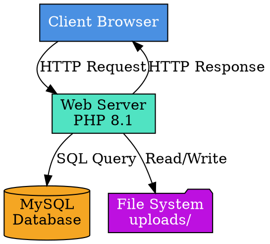

---

## 2. Deployment Architecture

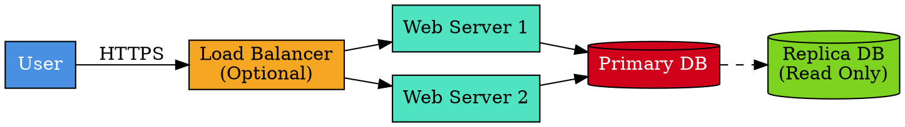

---

## 3. Entity Relationship Diagram

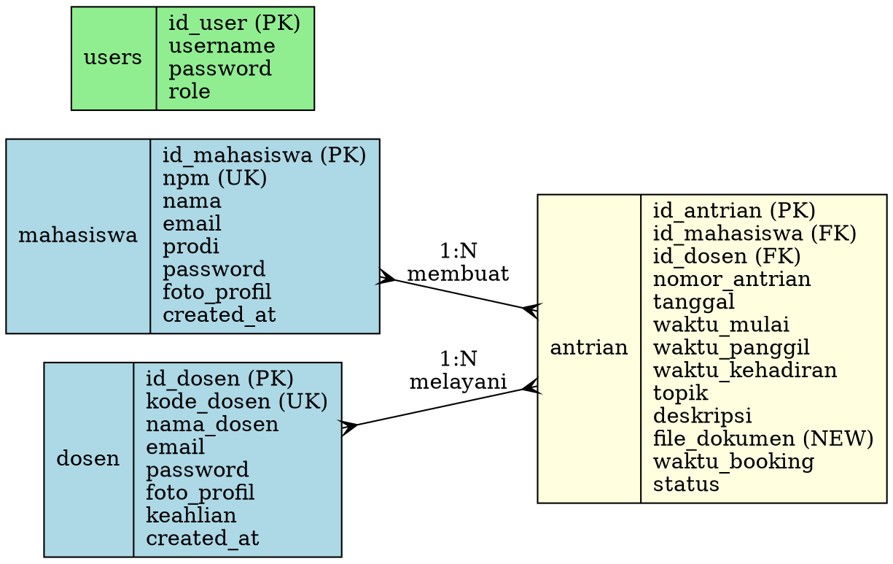

---

## 4. Use Case Diagram

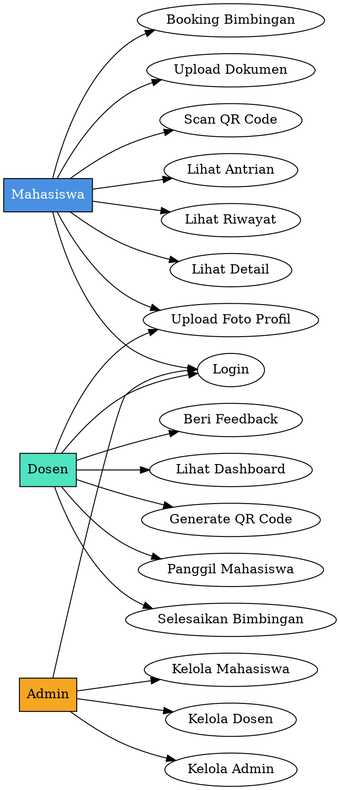

---

## 5. Login Flow

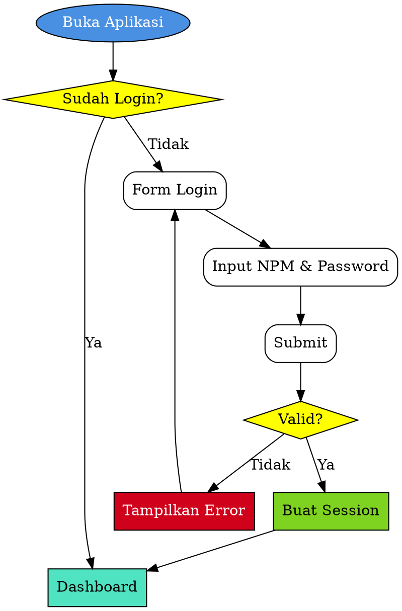

---

## 6. Booking Flow

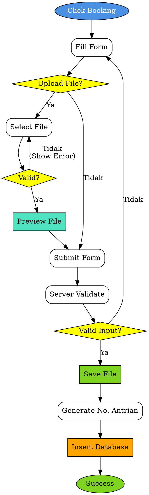

---

## 7. QR Scan Flow

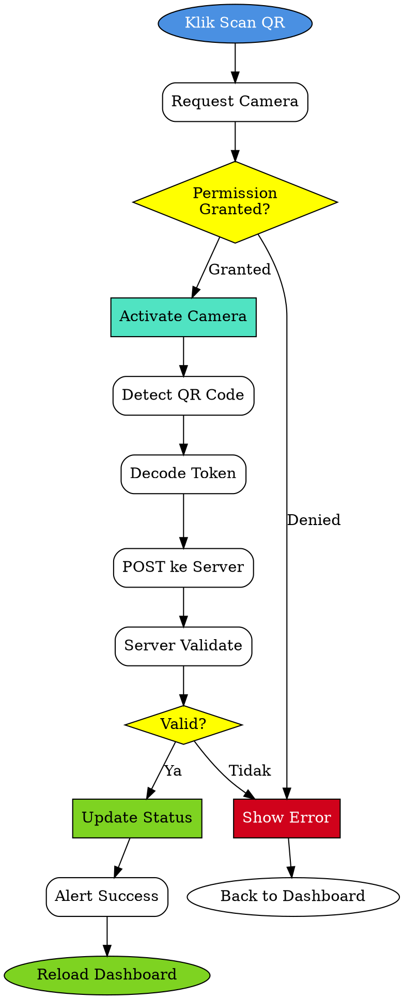

---

## 8. Cancel Booking Flow **[NEW]**

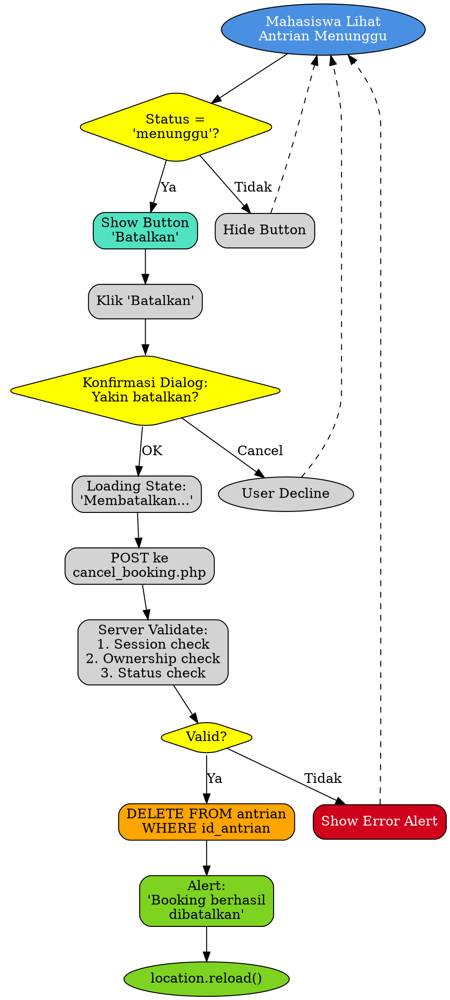

---

## 9. Status State Diagram

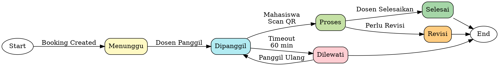

---

## 10. Dashboard Dosen Load Flow

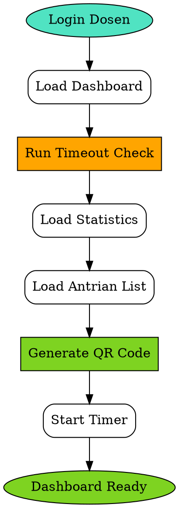

---

## 11. Complete Booking Process (Activity Diagram)

```dot
digraph CompleteBookingProcess {
    rankdir=TB;
    node [shape=box, style=rounded];
    
    start [label="Mahasiswa Login", shape=ellipse, fillcolor="#4A90E2", fontcolor=white, style=filled];
    openDashboard [label="Open Dashboard"];
    clickBooking [label="Click Booking"];
    fillForm [label="Fill Form"];
    submitForm [label="Submit Form"];
    serverValidate [label="Server Validate"];
    saveFile [label="Save File", fillcolor="#50E3C2", style=filled];
    generateNo [label="Generate No. Antrian"];
    insertDB [label="Insert Database", fillcolor=orange, style=filled];
    statusMenunggu [label="Status: Menunggu", fillcolor="#FFF9C4", style=filled];
    dosenPanggil [label="Dosen Click Panggil"];
    statusDipanggil [label="Status: Dipanggil", fillcolor="#B2EBF2", style=filled];
    mahasiswaScan [label="Mahasiswa Scan QR"];
    qrValid [label="QR Valid?", shape=diamond, fillcolor=yellow, style=filled];
    statusProses [label="Status: Proses", fillcolor="#C5E1A5", style=filled];
    bimbinganSelesai [label="Bimbingan Selesai"];
    dosenFeedback [label="Dosen Input Feedback"];
    statusSelesai [label="Status: Selesai", fillcolor="#A5D6A7", style=filled];
    end [label="End", shape=ellipse, fillcolor="#7ED321", style=filled];
    errorQR [label="Show Error", fillcolor="#D0021B", fontcolor=white, style=filled];
    
    start -> openDashboard;
    openDashboard -> clickBooking;
    clickBooking -> fillForm;
    fillForm -> submitForm;
    submitForm -> serverValidate;
    serverValidate -> saveFile;
    saveFile -> generateNo;
    generateNo -> insertDB;
    insertDB -> statusMenunggu;
    statusMenunggu -> dosenPanggil;
    dosenPanggil -> statusDipanggil;
    statusDipanggil -> mahasiswaScan;
    mahasiswaScan -> qrValid;
    qrValid -> errorQR [label="Tidak"];
    errorQR -> mahasiswaScan;
    qrValid -> statusProses [label="Ya"];
    statusProses -> bimbinganSelesai;
    bimbinganSelesai -> dosenFeedback;
    dosenFeedback -> statusSelesai;
    statusSelesai -> end;
}
```

---

## 📝 Cara Menggunakan

1. **Pilih diagram** yang ingin divisualisasi
2. **Copy kode DOT** dari diagram tersebut
3. **Buka Graphviz Online:** https://dreampuf.github.io/GraphvizOnline/
4. **Paste kode** di editor
5. **Lihat hasil render** di sebelah kanan
6. **Export** sebagai PNG/SVG jika perlu

---

## 🎨 Keterangan Warna

| Warna | Hex Code | Penggunaan |
|-------|----------|------------|
| Biru | #4A90E2 | Mahasiswa / User |
| Hijau Muda | #50E3C2 | Dosen / Web Server |
| Orange | #F5A623 | Admin / Load Balancer |
| Merah | #D0021B | Database Primary / Error |
| Hijau | #7ED321 | Success / Replica DB |
| Ungu | #BD10E0 | File System |
| Kuning | Yellow | Decision / Kondisi |

---

## 🔧 Tips Graphviz

### Mengubah Layout
```dot
// Horizontal
rankdir=LR;

// Vertical  
rankdir=TB;
```

### Node Shapes
```dot
shape=box         // Kotak
shape=ellipse     // Oval
shape=diamond     // Diamond (untuk kondisi)
shape=cylinder    // Silinder (untuk database)
shape=folder      // Folder
shape=record      // Tabel (untuk ER diagram)
```

### Styling
```dot
style=filled              // Isi warna
style=rounded            // Sudut membulat
style="rounded,filled"   // Kombinasi
fillcolor="#HEXCODE"     // Warna isi
fontcolor=white          // Warna teks
```

---

Semua diagram ini merepresentasikan arsitektur dan workflow lengkap aplikasi BimCheck.
