# 🎯 FLOWCHART UTAMA - BimCheck Landing Page

**Flowchart Terbaik untuk Presentasi & Landing Page**

Visualisasi: https://dreampuf.github.io/GraphvizOnline/

---

## 📊 Enhanced Complete Booking Process

**Flowchart ini menunjukkan:**
- ✅ Full end-to-end process
- ✅ Semua fitur (Booking, Upload, QR, Cancel, Feedback)
- ✅ Decision points & error handling
- ✅ Multiple actors (Mahasiswa, Dosen, System)
- ✅ All status transitions

---

## 🔥 FLOWCHART LENGKAP (Copy & Paste ke Graphviz)

```dot
digraph BimCheckCompleteFlow {
    rankdir=TB;
    node [shape=box, style="rounded,filled", fontname="Arial"];
    
    // ========== MAHASISWA SECTION ==========
    subgraph cluster_login {
        label="FASE 1: LOGIN & BOOKING";
        style=filled;
        fillcolor="#E8F4F8";
        fontsize=14;
        fontname="Arial Bold";
        
        start [label="Mahasiswa\nBuka Aplikasi", shape=ellipse, fillcolor="#4A90E2", fontcolor=white];
        login [label="Login dengan\nNPM & Password"];
        authCheck [label="Valid?", shape=diamond, fillcolor="#FFF9C4"];
        loginError [label="Error:\nLogin Gagal", fillcolor="#FFCDD2"];
        dashboard [label="Dashboard\nMahasiswa", fillcolor="#C5E1A5"];
        
        start -> login;
        login -> authCheck;
        authCheck -> loginError [label="Tidak"];
        authCheck -> dashboard [label="Ya"];
        loginError -> login;
    }
    
    subgraph cluster_booking {
        label="FASE 2: BOOKING BIMBINGAN";
        style=filled;
        fillcolor="#FFF9E6";
        fontsize=14;
        fontname="Arial Bold";
        
        clickBook [label="Click\n'Booking Pertemuan'"];
        fillForm [label="Isi Form:\n- Dosen\n- Topik\n- Tanggal & Waktu"];
        uploadFile [label="Upload File?", shape=diamond, fillcolor="#FFF9C4"];
        selectFile [label="Select File\n(PDF/DOC/JPG)"];
        validateFile [label="Valid?\n(Type & Size)", shape=diamond, fillcolor="#FFF9C4"];
        fileError [label="Error:\nFile Invalid", fillcolor="#FFCDD2"];
        preview [label="Preview File", fillcolor="#C5E1A5"];
        submitForm [label="Submit Form"];
        
        clickBook -> fillForm;
        fillForm -> uploadFile;
        uploadFile -> selectFile [label="Ya"];
        uploadFile -> submitForm [label="Tidak"];
        selectFile -> validateFile;
        validateFile -> fileError [label="Tidak"];
        validateFile -> preview [label="Ya"];
        fileError -> selectFile;
        preview -> submitForm;
    }
    
    subgraph cluster_validation {
        label="FASE 3: SERVER PROCESSING";
        style=filled;
        fillcolor="#E8F8E8";
        fontsize=14;
        fontname="Arial Bold";
        
        serverValidate [label="Server:\nValidate Input", fillcolor=orange];
        saveFile [label="Save File\nto uploads/", fillcolor=orange];
        genNumber [label="Generate\nNomor Antrian", fillcolor=orange];
        insertDB [label="INSERT INTO\nantrian", fillcolor=orange];
        statusMenunggu [label="STATUS:\nMENUNGGU", fillcolor="#FFF9C4", fontsize=12, penwidth=2];
        
        submitForm -> serverValidate;
        serverValidate -> saveFile;
        saveFile -> genNumber;
        genNumber -> insertDB;
        insertDB -> statusMenunggu;
    }
    
    // ========== CANCEL BOOKING OPTION ==========
    subgraph cluster_cancel {
        label="OPSI: CANCEL BOOKING";
        style=filled;
        fillcolor="#FFEBEE";
        fontsize=14;
        fontname="Arial Bold";
        
        viewQueue [label="Mahasiswa\nLihat Antrian"];
        cancelCheck [label="Ingin\nBatalkan?", shape=diamond, fillcolor="#FFF9C4"];
        cancelConfirm [label="Konfirmasi\nBatalkan?", shape=diamond, fillcolor="#FFF9C4"];
        deleteBooking [label="DELETE\nBooking", fillcolor="#FFCDD2"];
        cancelSuccess [label="Booking\nDibatalkan", shape=ellipse, fillcolor="#C5E1A5"];
        
        statusMenunggu -> viewQueue;
        viewQueue -> cancelCheck;
        cancelCheck -> cancelConfirm [label="Ya"];
        cancelCheck -> waitDosen [label="Tidak"];
        cancelConfirm -> deleteBooking [label="OK"];
        cancelConfirm -> viewQueue [label="Cancel"];
        deleteBooking -> cancelSuccess;
    }
    
    // ========== DOSEN SECTION ==========
    subgraph cluster_dosen {
        label="FASE 4: DOSEN MEMANGGIL";
        style=filled;
        fillcolor="#F3E5F5";
        fontsize=14;
        fontname="Arial Bold";
        
        waitDosen [label="Dosen Login\n& Lihat Antrian"];
        generateQR [label="Generate\nQR Code", fillcolor="#BD10E0", fontcolor=white];
        callStudent [label="Dosen Click\n'Panggil'"];
        statusDipanggil [label="STATUS:\nDIPANGGIL", fillcolor="#B2EBF2", fontsize=12, penwidth=2];
        timeout [label="60 Menit\nBerlalu?", shape=diamond, fillcolor="#FFF9C4"];
        statusDilewati [label="STATUS:\nDILEWATI", fillcolor="#FFCDD2", fontsize=12, penwidth=2];
        
        waitDosen -> generateQR;
        generateQR -> callStudent;
        callStudent -> statusDipanggil;
        statusDipanggil -> timeout;
        timeout -> statusDilewati [label="Ya\n(Timeout)"];
        timeout -> scanQR [label="Tidak"];
    }
    
    // ========== QR VALIDATION ==========
    subgraph cluster_qr {
        label="FASE 5: VALIDASI KEHADIRAN";
        style=filled;
        fillcolor="#E1F5FE";
        fontsize=14;
        fontname="Arial Bold";
        
        scanQR [label="Mahasiswa\nScan QR Code"];
        cameraPermission [label="Camera\nPermission?", shape=diamond, fillcolor="#FFF9C4"];
        cameraError [label="Error:\nNo Permission", fillcolor="#FFCDD2"];
        activateCamera [label="Activate\nCamera", fillcolor="#C5E1A5"];
        decodeQR [label="Decode QR:\nidDosen|timestamp"];
        validateQR [label="QR Valid?\n(Time & Dosen)", shape=diamond, fillcolor="#FFF9C4"];
        qrError [label="Error:\nQR Invalid", fillcolor="#FFCDD2"];
        statusProses [label="STATUS:\nPROSES", fillcolor="#C5E1A5", fontsize=12, penwidth=2];
        
        scanQR -> cameraPermission;
        cameraPermission -> cameraError [label="Denied"];
        cameraPermission -> activateCamera [label="Granted"];
        cameraError -> scanQR;
        activateCamera -> decodeQR;
        decodeQR -> validateQR;
        validateQR -> qrError [label="Tidak"];
        validateQR -> statusProses [label="Ya"];
        qrError -> scanQR;
    }
    
    // ========== BIMBINGAN & SELESAI ==========
    subgraph cluster_complete {
        label="FASE 6: BIMBINGAN & FEEDBACK";
        style=filled;
        fillcolor="#E8F5E9";
        fontsize=14;
        fontname="Arial Bold";
        
        bimbingan [label="Proses\nBimbingan\nBerlangsung"];
        dosenComplete [label="Dosen Click\n'Selesai'"];
        inputFeedback [label="Input Feedback\n(Optional)"];
        saveFeedback [label="Save Feedback\nto Database", fillcolor=orange];
        statusSelesai [label="STATUS:\nSELESAI", fillcolor="#A5D6A7", fontsize=12, penwidth=2];
        viewFeedback [label="Mahasiswa\nLihat Feedback"];
        end [label="END", shape=ellipse, fillcolor="#7ED321"];
        
        statusProses -> bimbingan;
        bimbingan -> dosenComplete;
        dosenComplete -> inputFeedback;
        inputFeedback -> saveFeedback;
        saveFeedback -> statusSelesai;
        statusSelesai -> viewFeedback;
        viewFeedback -> end;
    }
    
    // ========== CROSS-CLUSTER CONNECTIONS ==========
    dashboard -> clickBook;
    statusDilewati -> end [label="Mahasiswa\nTidak Hadir", style=dashed, color=red];
}
```



---

## 🎨 Keterangan Warna:

| Warna | Kode | Penggunaan |
|-------|------|-----------|
| Biru Muda | #E8F4F8 | Login & Booking |
| Kuning Muda | #FFF9E6 | Form Processing |
| Hijau Muda | #E8F8E8 | Server Processing |
| Merah Muda | #FFEBEE | Cancel Option |
| Ungu Muda | #F3E5F5 | Dosen Actions |
| Biru Langit | #E1F5FE | QR Validation |
| Hijau | #E8F5E9 | Success/Complete |

---

## 📌 Status Transitions:

```
MENUNGGU → (Cancel) → DIBATALKAN
MENUNGGU → (Panggil) → DIPANGGIL
DIPANGGIL → (Timeout) → DILEWATI
DIPANGGIL → (Scan QR) → PROSES
PROSES → (Selesai) → SELESAI
```

---

## 🚀 Cara Menggunakan:

1. **Copy kode Graphviz di atas**
2. **Paste ke:** https://dreampuf.github.io/GraphvizOnline/
3. **Export sebagai SVG** (untuk quality terbaik)
4. **Embed di landing page** Anda

---

## 💡 Keunggulan Flowchart Ini:

✅ **Comprehensive** - Mencakup SEMUA fitur aplikasi
✅ **6 Fase Jelas** - Login, Booking, Processing, Cancel, QR, Selesai
✅ **Decision Points** - Semua kondisi ditampilkan
✅ **Error Handling** - Login error, file error, QR error
✅ **Multiple Actors** - Mahasiswa, Dosen, System
✅ **All Features** - File upload, QR scan, Cancel booking, Feedback
✅ **Professional** - Grouped dengan subgraphs, warna konsisten
✅ **Academic** - Cocok untuk presentasi skripsi/TA

---

**Flowchart ini TERBAIK untuk:**
- 🎓 Presentasi Skripsi/TA
- 🌐 Landing Page Section "How It Works"
- 📄 Dokumentasi Teknis
- 👨‍🏫 Presentasi ke Dosen Pembimbing

**Dijamin Dospem akan Terkesan!** 🏆
