# 🔄 Workflow dan Flowchart - BimCheck

Dokumentasi lengkap alur kerja sistem dengan flowchart dalam format Graphviz DOT.

**Visualisasi:** https://dreampuf.github.io/GraphvizOnline/

---

## 📑 Daftar Isi

- [Use Case Diagram](#1-use-case-diagram)
- [Workflow Mahasiswa](#2-workflow-mahasiswa)
- [Workflow Dosen](#3-workflow-dos en)
- [Workflow Admin](#4-workflow-admin)
- [State Diagram](#5-state-diagram)
- [Activity Diagrams](#6-activity-diagrams)

---

## 1. Use Case Diagram

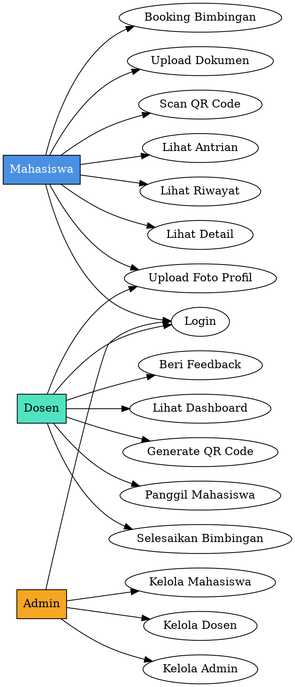

---

## 2. Workflow Mahasiswa

### 2.1. Login Flow

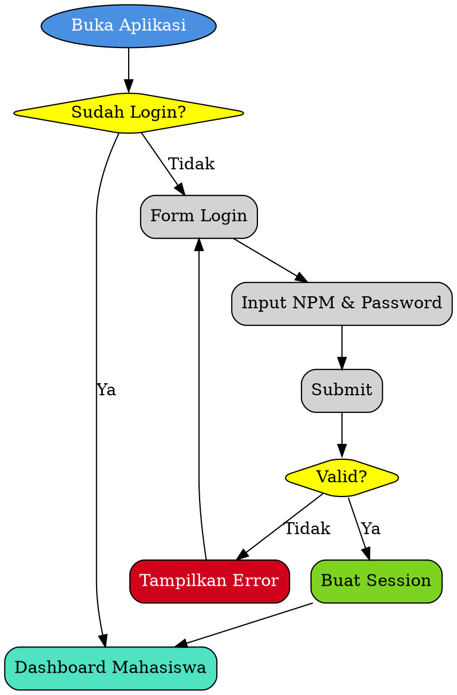

---

### 2.2. Booking Bimbingan Flow (Lengkap)

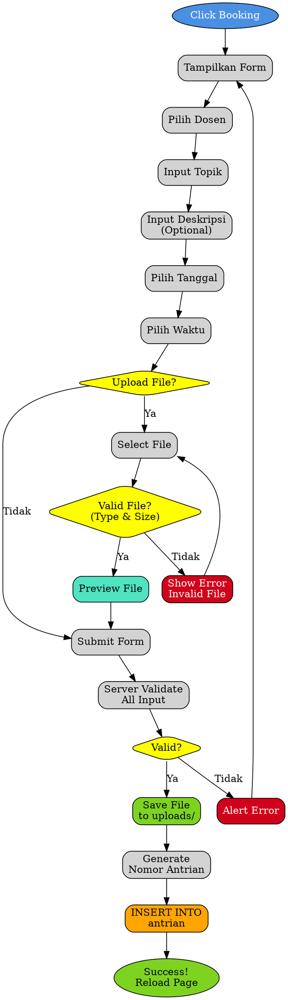

---

### 2.3. QR Code Scan Flow (Lengkap)

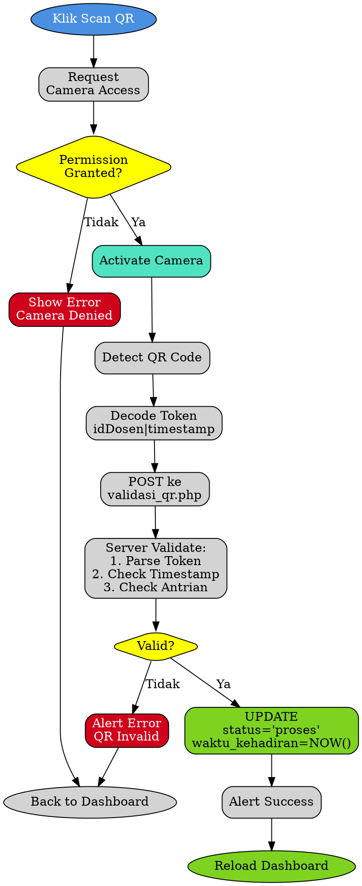

---

### 2.4. View Detail Flow

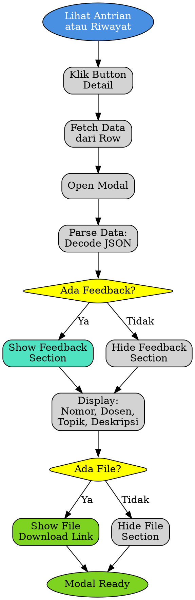

---

## 3. Workflow Dosen

### 3.1. Dashboard Load Flow

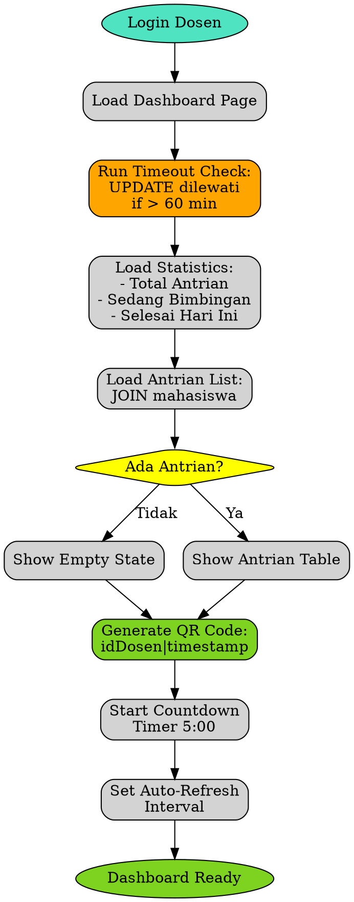

---

### 3.2. Call Student (Panggil Mahasiswa) Flow

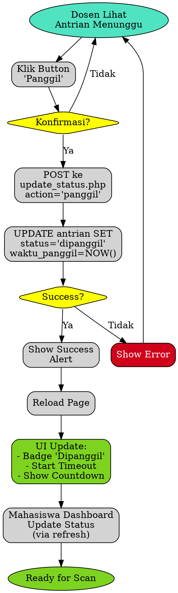

---

### 3.3. QR Generation & Auto-Refresh Flow

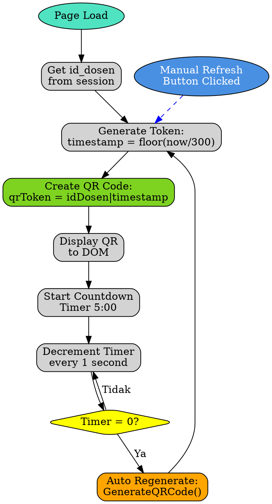

---

### 3.4. Complete Bimbingan (Selesaikan) Flow

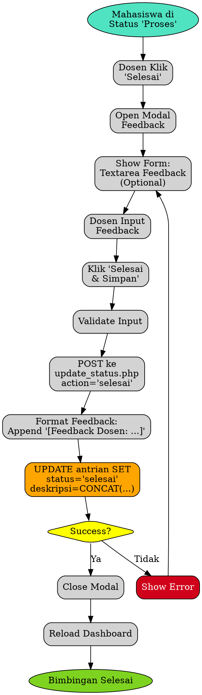

---

## 4. Workflow Admin

### 4.1. CRUD Operations Flow

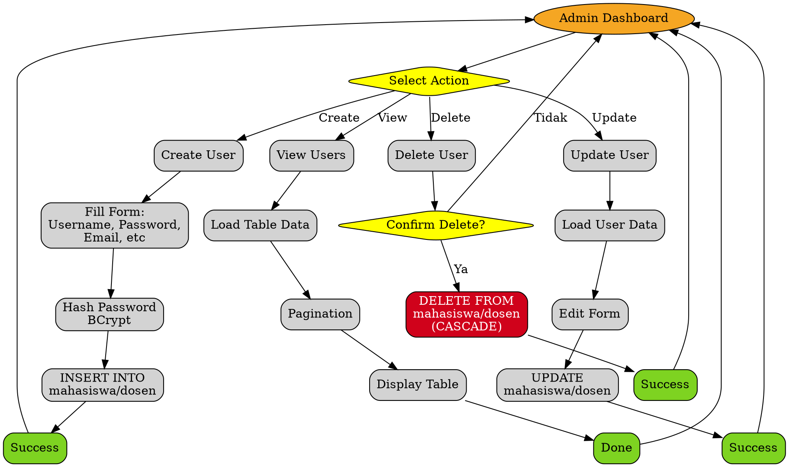

---

## 5. State Diagram - Antrian Status

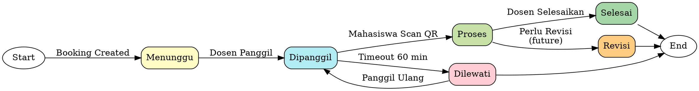

**Status Transitions Table:**

| From | To | Trigger | Actor |
|------|-----|---------|-------|
| - | Menunggu | Booking dibuat | Mahasiswa |
| Menunggu | Dipanggil | Klik "Panggil" | Dosen |
| Dipanggil | Proses | Scan QR | Mahasiswa |
| Dipanggil | Dilewati | Timeout 60 min | System |
| Proses | Selesai | Klik "Selesai" | Dosen |
| Dilewati | Dipanggil | Klik "Panggil" lagi | Dosen |

---

## 6. Activity Diagrams

### 6.1. Complete Booking Process (End-to-End)

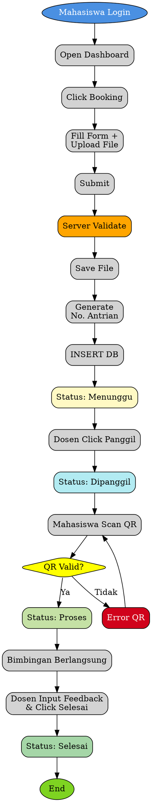

---

### 6.2. File Upload Process (Detail)

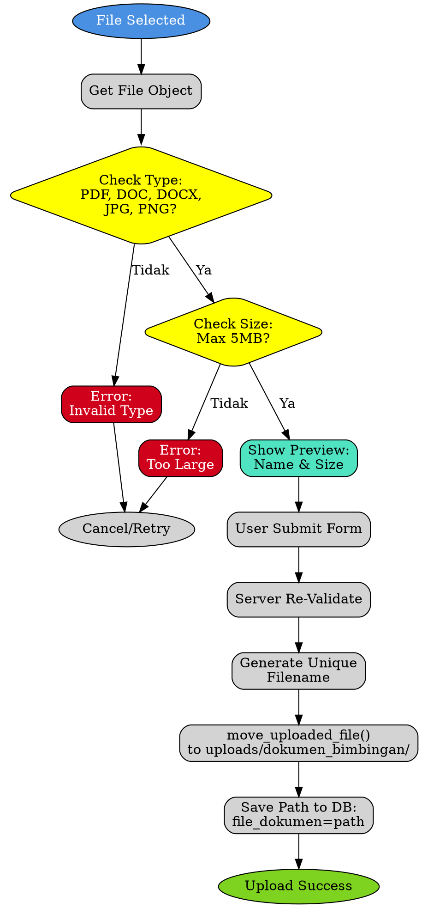

---

### 6.3. Timeout Management Flow

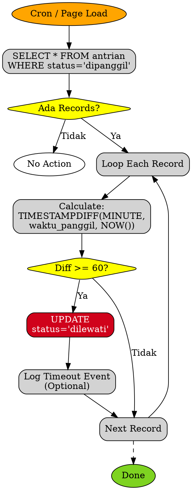

---

## 📋 Use Case Scenarios

### Scenario 1: Happy Path (Successful Booking)

**Actors:** Mahasiswa, Dosen, System  
**Pre-condition:** Mahasiswa sudah login

**Flow:**
1. Mahasiswa open dashboard → Click "Booking Pertemuan"
2. Fill form: Pilih dosen, topik, deskripsi, tanggal, waktu
3. Upload file: "draft_bab3.pdf" (validated ✅)
4. Submit → Server validate → File saved → Generate nomor A001
5. Status: **Menunggu** ← INSERT database
6. Dosen lihat antrian baru ← Dashboard refresh
7. Dosen klik "Panggil" → Status: **Dipanggil**
8. Mahasiswa lihat status berubah → Scan QR code
9. QR validated ✅ → Status: **Proses**
10. Bimbingan berlangsung...
11. Dosen klik "Selesai" → Input feedback: "Perbaiki metodologi"
12. Status: **Selesai** → Feedback tersimpan
13. Mahasiswa lihat feedback di riwayat ✅

**Post-condition:** Bimbingan recorded with feedback

---

### Scenario 2: Timeout (Mahasiswa Tidak Hadir)

**Flow:**
1-7. Same as Scenario 1 (sampai status "Dipanggil")
8. Mahasiswa **tidak datang** ❌
9. 60 menit berlalu...
10. System auto-check timeout → Status: **Dilewati**
11. Dosen lihat status berubah
12. Dosen bisa panggil mahasiswa lain
13. (Optional) Dosen bisa panggil ulang → Status kembali "Dipanggil"

---

### Scenario 3: File Upload Validation Error

**Flow:**
1-2. Same as Scenario 1
3. Upload "document.exe" ❌ Invalid type
4. Client validation: **Reject** → Alert error
5. Remove file → Upload "large_file.pdf" (7MB) ❌ Too large
6. Client validation: **Reject** → Alert error  
7. Compress file → Upload "draft_compressed.pdf" (3MB) ✅
8. Validation: **Pass**
9. Continue normal flow...

---

## 🔄 Process Summary

| Process | Start | End | Duration (est) |
|---------|-------|-----|----------------|
| Login | Open App | Dashboard | ~10 sec |
| Booking | Click Book | Status Menunggu | ~2 min |
| QR Scan | Request Camera | Status Proses | ~30 sec |
| Bimbingan | Proses | Selesai | ~30 min |
| Admin CRUD | Select Action | Success | ~1 min |

---

Dokumentasi workflow lengkap dengan semua flowchart dalam format Graphviz DOT.
